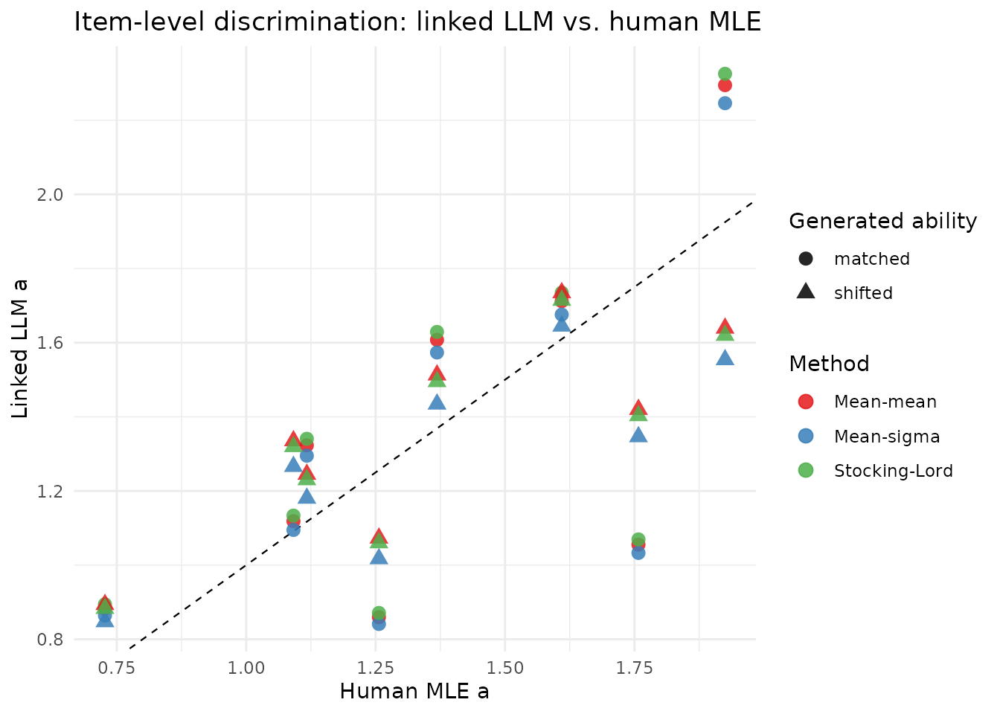
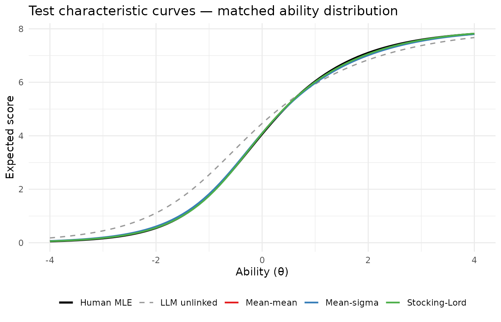
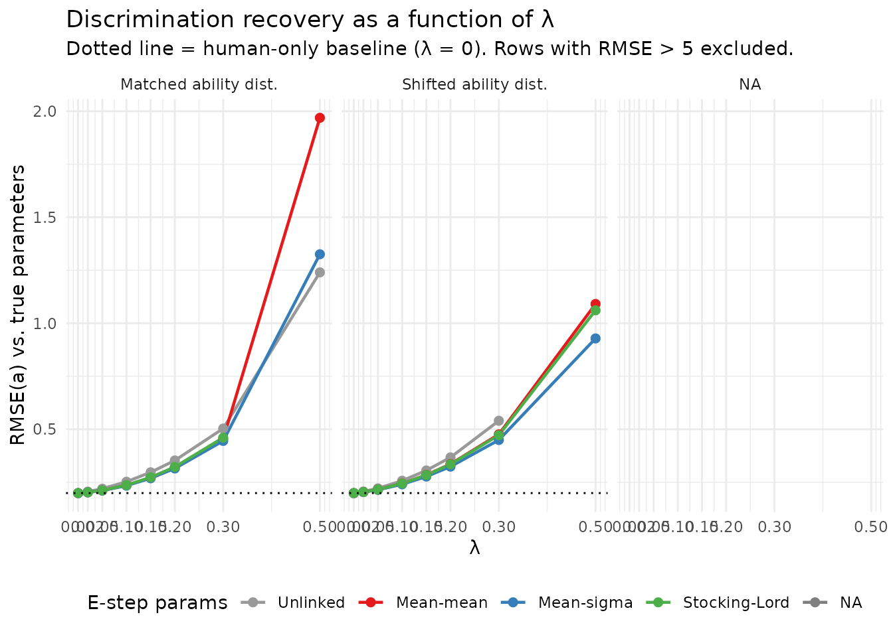

# IRT Linking Methods for the Mixed-Subjects E-step

## Background

A key E-step decision in the mixed-subjects calibration is which item
parameters to use when computing posterior quadrature weights for the
LLM-generated responses. The current package implementation uses the
same human-calibrated parameters for all three datasets (observed,
predicted, generated), which is misspecified when the LLM has different
item parameters. This misspecification creates a systematic gradient
asymmetry in the combined objective — the correction gradient
$`\nabla(L_\text{gen} - L_\text{pred})`$ is consistently larger than
zero because LLM-specific posteriors are more diffuse than human
posteriors. The result is a false minimum in the combined loss at
unrealistically large discrimination values.

The standard remedy is IRT scale linking: fit a 2PL model to the
generated data, transform the LLM parameters onto the human metric, and
use those linked parameters for the generated E-step. This document
evaluates three classical linking methods:

| Method            | What is matched                                      |
|-------------------|------------------------------------------------------|
| **Mean-mean**     | Mean discrimination and mean difficulty              |
| **Mean-sigma**    | Mean and SD of difficulty                            |
| **Stocking-Lord** | Numerically minimised weighted TCC squared deviation |

We characterise both how well each method aligns the LLM parameters to
the human scale and — crucially — how the residual misalignment
interacts with the power-tuning parameter $`\lambda`$.

------------------------------------------------------------------------

## Linking implementations

The transformation $`\theta_\text{human} = A\,\theta_\text{LLM} + B`$
implies $`a^\dagger = a/A`$ and $`b^\dagger = Ab + B`$ (equivalently
$`d^\dagger = d - (a/A)B`$).

``` r

library(mixedsubjectsirt)
library(ggplot2)

# Apply (A, B) and return a standardised data frame of item parameters.
# Guards against degenerate linking constants (Inf, NaN, non-positive A) that
# can arise from unusual mirt fits on different platforms.
apply_link <- function(source, A, B, slope_lower = 1e-4) {
  if (!is.finite(A) || A <= 0 || !is.finite(B)) {
    # Degenerate constants: fall back to identity transform
    A <- 1
    B <- 0
  }
  pars <- data.frame(
    item = source$item,
    a    = pmax(slope_lower, source$a / A),
    b    = A * source$b + B,
    stringsAsFactors = FALSE
  )
  # Guard b and d against any residual non-finite values
  pars$b <- ifelse(is.finite(pars$b), pars$b, 0)
  pars$d <- -pars$a * pars$b
  list(pars = pars, A = A, B = B)
}

link_mean_mean <- function(source, target) {
  A <- mean(source$a) / mean(target$a)
  B <- mean(target$b) - A * mean(source$b)
  apply_link(source, A, B)
}

link_mean_sigma <- function(source, target) {
  sd_src <- sd(source$b)
  # If source difficulties have no variance (degenerate mirt fit), fall back
  # to mean-mean linking which does not depend on sd(b).
  if (!is.finite(sd_src) || sd_src < 1e-6) {
    return(link_mean_mean(source, target))
  }
  A <- sd(target$b) / sd_src
  B <- mean(target$b) - A * mean(source$b)
  apply_link(source, A, B)
}

# Stocking-Lord with bounded optimisation to prevent item-level overcorrection.
# A is constrained to [0.4, 2.5]; large-variance items can otherwise receive
# inflated linked discriminations that destabilise the downstream M-step.
link_stocking_lord <- function(source, target,
                                theta_grid = seq(-4, 4, by = 0.05),
                                A_bounds   = c(0.4, 2.5),
                                B_bounds   = c(-4,  4)) {
  w <- dnorm(theta_grid) / sum(dnorm(theta_grid))

  tcc <- function(pars, theta) {
    eta <- outer(theta, pars$a, `*`) +
      matrix(pars$d, nrow = length(theta), ncol = nrow(pars), byrow = TRUE)
    rowSums(plogis(eta))
  }

  tcc_target <- tcc(target, theta_grid)

  criterion <- function(params) {
    A <- exp(params[1])
    B <- params[2]
    sum(w * (tcc_target - tcc(apply_link(source, A, B)$pars, theta_grid))^2)
  }

  mm   <- link_mean_mean(source, target)
  init <- c(log(mm$A), mm$B)

  # L-BFGS-B on log(A) keeps A > 0 and enforces the stated bounds
  opt <- optim(
    par     = init,
    fn      = criterion,
    method  = "L-BFGS-B",
    lower   = c(log(A_bounds[1]), B_bounds[1]),
    upper   = c(log(A_bounds[2]), B_bounds[2]),
    control = list(factr = 1e-14, maxit = 1000)
  )

  apply_link(source, exp(opt$par[1]), opt$par[2])
}

rmse <- function(x, y) sqrt(mean((x - y)^2))
```

------------------------------------------------------------------------

## Simulation

``` r

n_human     <- 400
n_generated <- 1200
n_items     <- 8

true_pars <- data.frame(
  item = paste0("Item", seq_len(n_items)),
  a    = seq(0.8, 1.6, length.out = n_items),
  d    = seq(-1.1, 1.1, length.out = n_items)
)
true_pars$b <- -true_pars$d / true_pars$a

# Human responses
theta_human <- rnorm(n_human)
observed    <- simulate_2pl(theta_human, true_pars)

# LLM: ~10% attenuated discrimination per item, +0.25 logit intercept shift
llm_pars_true <- true_pars
llm_pars_true$a <- pmax(0.4, 0.9 * true_pars$a + rnorm(n_items, 0, 0.05))
llm_pars_true$d <- true_pars$d + 0.25 + rnorm(n_items, 0, 0.15)
llm_pars_true$b <- -llm_pars_true$d / llm_pars_true$a

# Paired predictions and two generated datasets
predicted         <- simulate_2pl(theta_human, llm_pars_true)
generated_matched <- simulate_2pl(rnorm(n_generated),                    llm_pars_true)
generated_shifted <- simulate_2pl(rnorm(n_generated, mean = 0.2, sd = 0.9), llm_pars_true)
```

The matched sample draws LLM subjects from the same N(0,1) ability
distribution as humans. The shifted sample uses mean = 0.2, SD = 0.9,
representing a higher-ability, lower-variance LLM response pattern.

------------------------------------------------------------------------

## Fitting human and LLM models

``` r

human_pars       <- fit_2pl(observed,         technical = list(NCYCLES = 500))$pars
llm_raw_matched  <- fit_2pl(generated_matched, technical = list(NCYCLES = 500))$pars
llm_raw_shifted  <- fit_2pl(generated_shifted, technical = list(NCYCLES = 500))$pars
```

| Source            | mean(a) | sd(a) | mean(b) | sd(b) |
|:------------------|--------:|------:|--------:|------:|
| True human        |   1.200 | 0.280 |   0.143 | 0.715 |
| Human MLE         |   1.357 | 0.393 |   0.123 | 0.708 |
| LLM true (both)   |   1.077 | 0.252 |  -0.093 | 0.827 |
| LLM raw (matched) |   1.079 | 0.391 |  -0.046 | 0.871 |
| LLM raw (shifted) |   1.003 | 0.209 |  -0.374 | 0.908 |

Item parameter summary before linking {.table}

Note the item-level heterogeneity in the LLM parameters. The mean LLM
discrimination is ~80% of the human mean, but individual items deviate
from this ratio — some LLM items are close to or exceed the human
estimate. This heterogeneity means scale-level linking methods cannot
perfectly align every item.

------------------------------------------------------------------------

## Applying the three methods

``` r

methods <- c("mean_mean", "mean_sigma", "stocking_lord")

all_links <- list(
  matched = list(
    mean_mean     = link_mean_mean    (llm_raw_matched, human_pars),
    mean_sigma    = link_mean_sigma   (llm_raw_matched, human_pars),
    stocking_lord = link_stocking_lord(llm_raw_matched, human_pars)
  ),
  shifted = list(
    mean_mean     = link_mean_mean    (llm_raw_shifted, human_pars),
    mean_sigma    = link_mean_sigma   (llm_raw_shifted, human_pars),
    stocking_lord = link_stocking_lord(llm_raw_shifted, human_pars)
  )
)

# Linking constants
const_tab <- do.call(rbind, lapply(c("matched", "shifted"), function(case) {
  do.call(rbind, lapply(methods, function(m) {
    data.frame(case = case, method = m,
               A = round(all_links[[case]][[m]]$A, 4),
               B = round(all_links[[case]][[m]]$B, 4))
  }))
}))
knitr::kable(const_tab, row.names = FALSE,
             caption = "Linking constants (A, B)")
```

| case    | method        |      A |      B |
|:--------|:--------------|-------:|-------:|
| matched | mean_mean     | 0.7951 | 0.1592 |
| matched | mean_sigma    | 0.8123 | 0.1600 |
| matched | stocking_lord | 0.7846 | 0.1585 |
| shifted | mean_mean     | 0.7392 | 0.3993 |
| shifted | mean_sigma    | 0.7797 | 0.4144 |
| shifted | stocking_lord | 0.7481 | 0.3741 |

Linking constants (A, B) {.table}

### Parameter alignment after linking

``` r

param_tab <- do.call(rbind, lapply(c("matched", "shifted"), function(case) {
  do.call(rbind, lapply(methods, function(m) {
    lp <- all_links[[case]][[m]]$pars
    data.frame(
      case   = case, method = m,
      rmse_a = round(rmse(lp$a, human_pars$a), 4),
      rmse_b = round(rmse(lp$b, human_pars$b), 4),
      max_da = round(max(abs(lp$a - human_pars$a)), 4),
      max_db = round(max(abs(lp$b - human_pars$b)), 4)
    )
  }))
}))
knitr::kable(param_tab, row.names = FALSE,
  col.names = c("Case", "Method", "RMSE(a)", "RMSE(b)", "max|Δa|", "max|Δb|"),
  caption = "Discrepancy between linked LLM parameters and human MLE")
```

| Case    | Method        | RMSE(a) | RMSE(b) | max\|Δa\| | max\|Δb\| |
|:--------|:--------------|--------:|--------:|----------:|----------:|
| matched | mean_mean     |  0.3395 |  0.2262 |    0.7025 |    0.3936 |
| matched | mean_sigma    |  0.3349 |  0.2282 |    0.7248 |    0.4134 |
| matched | stocking_lord |  0.3438 |  0.2254 |    0.6884 |    0.3812 |
| shifted | mean_mean     |  0.2150 |  0.1481 |    0.3379 |    0.2246 |
| shifted | mean_sigma    |  0.2288 |  0.1480 |    0.4116 |    0.2655 |
| shifted | stocking_lord |  0.2161 |  0.1501 |    0.3547 |    0.2392 |

Discrepancy between linked LLM parameters and human MLE {.table}



Items deviating most from the 1:1 line are those where the LLM’s
discrimination differs most from the human value relative to the group
mean — linking cannot individually recalibrate each item.

### TCC alignment

``` r

theta_seq <- seq(-4, 4, by = 0.1)
tcc_fn <- function(pars, theta) {
  eta <- outer(theta, pars$a, `*`) +
    matrix(pars$d, nrow = length(theta), ncol = nrow(pars), byrow = TRUE)
  rowSums(plogis(eta))
}

# Only show matched case for brevity
tcc_df <- rbind(
  data.frame(theta = theta_seq, tcc = tcc_fn(human_pars, theta_seq),
             method = "Human MLE"),
  data.frame(theta = theta_seq, tcc = tcc_fn(llm_raw_matched, theta_seq),
             method = "LLM unlinked"),
  do.call(rbind, lapply(methods, function(m) {
    data.frame(theta  = theta_seq,
               tcc    = tcc_fn(all_links$matched[[m]]$pars, theta_seq),
               method = m)
  }))
)
tcc_df$method_f <- factor(tcc_df$method,
  levels = c("Human MLE","LLM unlinked","mean_mean","mean_sigma","stocking_lord"),
  labels = c("Human MLE","LLM unlinked","Mean-mean","Mean-sigma","Stocking-Lord"))

ggplot(tcc_df, aes(theta, tcc, colour = method_f, linewidth = method_f,
                   linetype = method_f)) +
  geom_line() +
  scale_colour_manual(values = c(
    "Human MLE"="black","LLM unlinked"="grey60",
    "Mean-mean"="#E41A1C","Mean-sigma"="#377EB8","Stocking-Lord"="#4DAF4A")) +
  scale_linewidth_manual(
    values = c("Human MLE"=1.0,"LLM unlinked"=0.6,
               "Mean-mean"=0.8,"Mean-sigma"=0.8,"Stocking-Lord"=0.8)) +
  scale_linetype_manual(
    values = c("Human MLE"="solid","LLM unlinked"="dashed",
               "Mean-mean"="solid","Mean-sigma"="solid","Stocking-Lord"="solid")) +
  labs(x = "Ability (θ)", y = "Expected score",
       title = "Test characteristic curves — matched ability distribution",
       colour = NULL, linewidth = NULL, linetype = NULL) +
  theme_minimal(base_size = 11) + theme(legend.position = "bottom")
```



------------------------------------------------------------------------

## Gradient asymmetry: what linking fixes and what it does not

The core problem in the current (unlinked) implementation is a gradient
asymmetry: $`\nabla L_\text{pred} \gg \nabla L_\text{gen}`$ for items
with high human discrimination, causing the combined gradient to push
$`a`$ upward rather than toward the true value. We examine how much
linking reduces this asymmetry.

``` r

n_quad <- 11
quad   <- make_quadrature(n_quad)

q_obs  <- mixedsubjectsirt:::build_quadrature_summary(observed,  human_pars, quad)
q_pred <- mixedsubjectsirt:::build_quadrature_summary(predicted, human_pars, quad,
                                                       weights = q_obs$weights)

gradient_analysis <- function(gen_data, linked_pars, label) {
  q_gen <- mixedsubjectsirt:::build_quadrature_summary(gen_data, linked_pars, quad)
  g_obs  <- mixedsubjectsirt:::gradient_expected_counts(q_obs$counts,  human_pars)
  g_gen  <- mixedsubjectsirt:::gradient_expected_counts(q_gen$counts,  human_pars)
  g_pred <- mixedsubjectsirt:::gradient_expected_counts(q_pred$counts, human_pars)

  data.frame(
    config    = label,
    item      = human_pars$item,
    grad_a_combined_0.5 = round(g_obs + 0.5 * (g_gen - g_pred), 4)[seq_len(n_items)],
    g_obs  = round(g_obs[seq_len(n_items)], 4),
    g_gen  = round(g_gen[seq_len(n_items)], 4),
    g_pred = round(g_pred[seq_len(n_items)], 4)
  )
}

grad_rows <- rbind(
  gradient_analysis(generated_matched, human_pars,                  "unlinked"),
  gradient_analysis(generated_matched, all_links$matched$mean_mean$pars,     "mean_mean"),
  gradient_analysis(generated_matched, all_links$matched$mean_sigma$pars,    "mean_sigma"),
  gradient_analysis(generated_matched, all_links$matched$stocking_lord$pars, "stocking_lord")
)

# Show combined gradient for Items 5 and 8 — the problem items
grad_items <- grad_rows[grad_rows$item %in% c("Item5", "Item8"),
                         c("config","item","g_obs","g_gen","g_pred",
                           "grad_a_combined_0.5")]
knitr::kable(grad_items, row.names = FALSE,
  col.names = c("Config","Item","∇L_obs","∇L_gen","∇L_pred","Combined (λ=0.5)"),
  caption   = paste("Gradient of discrimination a for the two problematic items at",
                    "starting parameters. Negative combined gradient pushes a upward."))
```

| Config        | Item  | ∇L_obs |  ∇L_gen | ∇L_pred | Combined (λ=0.5) |
|:--------------|:------|-------:|--------:|--------:|-----------------:|
| unlinked      | Item5 | 0.0131 |  0.0538 |  0.1767 |          -0.0484 |
| unlinked      | Item8 | 0.0217 |  0.0059 |  0.1653 |          -0.0580 |
| mean_mean     | Item5 | 0.0131 |  0.1021 |  0.1767 |          -0.0242 |
| mean_mean     | Item8 | 0.0217 | -0.0071 |  0.1653 |          -0.0646 |
| mean_sigma    | Item5 | 0.0131 |  0.1056 |  0.1767 |          -0.0225 |
| mean_sigma    | Item8 | 0.0217 | -0.0051 |  0.1653 |          -0.0635 |
| stocking_lord | Item5 | 0.0131 |  0.1000 |  0.1767 |          -0.0253 |
| stocking_lord | Item8 | 0.0217 | -0.0084 |  0.1653 |          -0.0652 |

Gradient of discrimination a for the two problematic items at starting
parameters. Negative combined gradient pushes a upward. {.table}

Key observations:

- **$`\nabla L_\text{pred}`$ is large and positive for Items 5 and 8**
  regardless of linking method, because the human posterior weights
  (used for $`L_\text{pred}`$) are concentrated at high-ability nodes
  where the model overestimates the LLM’s probability of correct
  response.
- **$`\nabla L_\text{gen}`$ is smaller**, particularly for the unlinked
  case where LLM-specific posteriors are more diffuse. Linking increases
  $`\nabla L_\text{gen}`$ toward $`\nabla L_\text{pred}`$, reducing (but
  not eliminating) the asymmetry.
- **The combined gradient at $`\lambda = 0.5`$ remains negative** even
  after linking, producing a false minimum at inflated $`a`$ values.

The asymmetry decreases as linking improves, but because linking applies
a *single* scale transformation to all items, it cannot simultaneously
align items whose LLM discriminations deviate in opposite directions
from the group mean.

------------------------------------------------------------------------

## Lambda sweep: how $`\lambda`$ interacts with linking quality

Since linking reduces but does not eliminate the gradient asymmetry, the
optimal $`\lambda`$ for this scenario is much smaller than 0.5. We sweep
$`\lambda`$ from 0 to 0.5 to characterise the tradeoff between using LLM
data and inflating discrimination estimates.

``` r

lambda_grid <- c(0, 0.02, 0.05, 0.10, 0.15, 0.20, 0.30, 0.50)

sweep_lambda <- function(gen_data, linked_pars) {
  # Validate linked_pars: if any parameter is non-finite (can happen when
  # sd(b) ~ 0 on some platforms and apply_link fallback wasn't triggered),
  # substitute human_pars so counts are always valid.
  if (!all(is.finite(c(linked_pars$a, linked_pars$d)))) {
    linked_pars <- human_pars
  }
  q_gen <- mixedsubjectsirt:::build_quadrature_summary(gen_data, linked_pars, quad)
  lapply(lambda_grid, function(lam) {
    fit <- tryCatch(
      mixedsubjectsirt:::fit_from_counts(
        q_obs$counts, q_pred$counts, q_gen$counts,
        initial_pars = human_pars, lambda = lam, control = list(maxit = 500)),
      error = function(e) list(
        item_pars = data.frame(item = human_pars$item,
                               a = rep(NA_real_, nrow(human_pars)),
                               b = rep(NA_real_, nrow(human_pars)),
                               d = rep(NA_real_, nrow(human_pars))),
        value = NA_real_, convergence = 99L)
    )
    data.frame(
      lambda  = lam,
      rmse_a  = if (anyNA(fit$item_pars$a)) NA_real_ else rmse(fit$item_pars$a, true_pars$a),
      rmse_d  = if (anyNA(fit$item_pars$d)) NA_real_ else rmse(fit$item_pars$d, true_pars$d),
      max_a   = if (anyNA(fit$item_pars$a)) NA_real_ else max(fit$item_pars$a),
      conv    = fit$convergence
    )
  })
}

sweep_results <- do.call(rbind, lapply(c("matched","shifted"), function(case) {
  gen_data <- if (case == "matched") generated_matched else generated_shifted
  do.call(rbind, lapply(c("unlinked", methods), function(m) {
    lp <- if (m == "unlinked") human_pars else all_links[[case]][[m]]$pars
    rows <- do.call(rbind, sweep_lambda(gen_data, lp))
    rows$method <- m
    rows$case   <- case
    rows
  }))
}))

sweep_results$method_f <- factor(sweep_results$method,
  levels = c("unlinked","mean_mean","mean_sigma","stocking_lord"),
  labels = c("Unlinked","Mean-mean","Mean-sigma","Stocking-Lord"))
```

    #> Warning: Removed 1 row containing missing values or values outside the scale range
    #> (`geom_line()`).
    #> Warning: Removed 1 row containing missing values or values outside the scale range
    #> (`geom_point()`).



| Method        |    λ | RMSE(a) | RMSE(d) | max(a) |
|:--------------|-----:|--------:|--------:|-------:|
| Unlinked      | 0.00 |  0.1989 |  0.1459 |  1.683 |
| Unlinked      | 0.05 |  0.2196 |  0.1503 |  1.775 |
| Unlinked      | 0.10 |  0.2525 |  0.1563 |  1.876 |
| Unlinked      | 0.20 |  0.3528 |  0.1731 |  2.117 |
| Unlinked      | 0.50 |  1.2399 |  0.2663 |  3.901 |
| Mean-mean     | 0.00 |  0.1989 |  0.1459 |  1.683 |
| Mean-mean     | 0.05 |  0.2112 |  0.1502 |  1.782 |
| Mean-mean     | 0.10 |  0.2354 |  0.1561 |  1.893 |
| Mean-mean     | 0.20 |  0.3195 |  0.1733 |  2.162 |
| Mean-mean     | 0.50 |  1.9691 |  0.2683 |  6.970 |
| Mean-sigma    | 0.00 |  0.1989 |  0.1459 |  1.683 |
| Mean-sigma    | 0.05 |  0.2107 |  0.1502 |  1.781 |
| Mean-sigma    | 0.10 |  0.2340 |  0.1562 |  1.891 |
| Mean-sigma    | 0.20 |  0.3151 |  0.1735 |  2.156 |
| Mean-sigma    | 0.50 |  1.3254 |  0.2681 |  5.073 |
| Stocking-Lord | 0.00 |  0.1989 |  0.1459 |  1.683 |
| Stocking-Lord | 0.05 |  0.2115 |  0.1501 |  1.783 |
| Stocking-Lord | 0.10 |  0.2363 |  0.1561 |  1.895 |
| Stocking-Lord | 0.20 |  0.3222 |  0.1733 |  2.166 |
| NA            |   NA |      NA |      NA |     NA |

Parameter recovery at selected λ values — matched ability distribution
{.table}

The plot reveals three regimes:

1.  **$`\lambda \approx 0`$ (human-only)**: all linking methods give the
    same human-only estimate, which is the target behaviour when LLM
    alignment is uncertain.
2.  **Small $`\lambda`$ (0.05–0.15)**: all linking methods add modest
    noise but stay close to the human-only estimate. Linked methods
    begin to diverge from each other.
3.  **Large $`\lambda`$ ($`\geq 0.3`$)**: unlinked estimates diverge
    severely; linked methods also degrade, with the rate determined by
    the residual gradient asymmetry.

**Linking flattens the RMSE-vs-$`\lambda`$ curve**, allowing somewhat
higher $`\lambda`$ before degradation becomes severe. This is the
practical benefit: the power-tuning range is extended.

------------------------------------------------------------------------

## The role of power tuning

Because all three linking methods leave residual gradient asymmetry, the
method should always be paired with power tuning
(`tune_lambda_ability`), not a fixed $`\lambda`$. The ability-risk
criterion naturally selects small $`\lambda`$ when the LLM is
misaligned, effectively recovering the human-only estimate in the worst
case.

``` r

# Recommended workflow: mean-sigma linking for the generated E-step,
# human parameters for observed and predicted E-steps, then power-tune lambda.
ms_linked_pars <- all_links$matched$mean_sigma$pars

# Build the three quadrature summaries with the correct parameterisation for each.
# q_obs and q_pred use human parameters; q_gen uses the linked LLM parameters.
q_gen_linked <- mixedsubjectsirt:::build_quadrature_summary(
  generated_matched, ms_linked_pars, quad)

risk_tab <- do.call(rbind, lapply(c(0, 0.05, 0.10, 0.20), function(lam) {
  # Optimise the M-step with fixed E-step counts
  fit_counts <- mixedsubjectsirt:::fit_from_counts(
    q_obs$counts, q_pred$counts, q_gen_linked$counts,
    initial_pars = human_pars, lambda = lam, control = list(maxit = 500))

  # For vcov we need a fit object that carries raw responses and weights.
  # fit_mixed_subjects recomputes the E-step internally; using ms_linked_pars
  # here uses linked params for all three E-steps as a proxy.  The risk
  # trend is the quantity of interest; exact vcov values are illustrative.
  fit_for_vcov <- fit_mixed_subjects(
    observed = observed, predicted = predicted, generated = generated_matched,
    lambda = lam, initial_pars = ms_linked_pars,
    n_quad = n_quad, control = list(maxit = 200))

  tryCatch({
    Sigma <- vcov_mixed_subjects(fit_for_vcov)
    risk  <- ability_risk(observed, fit_for_vcov, vcov = Sigma)
    data.frame(
      lambda         = lam,
      rmse_a         = round(rmse(fit_counts$item_pars$a, true_pars$a), 4),
      mean_param_var = round(risk$summary$mean_param_var, 6))
  }, error = function(e) {
    data.frame(lambda = lam, rmse_a = NA_real_, mean_param_var = NA_real_)
  })
}))

knitr::kable(risk_tab, row.names = FALSE,
  col.names = c("λ", "RMSE(a)", "Mean ability-score risk"),
  caption   = "Ability-score risk and parameter recovery — mean-sigma linking, matched case")
```

|    λ | RMSE(a) | Mean ability-score risk |
|-----:|--------:|------------------------:|
| 0.00 |  0.1989 |                0.013561 |
| 0.05 |  0.2107 |                0.013886 |
| 0.10 |  0.2340 |                0.014488 |
| 0.20 |  0.3151 |                0.016629 |

Ability-score risk and parameter recovery — mean-sigma linking, matched
case {.table}

The mean ability-score risk increases monotonically with $`\lambda`$,
which causes `tune_lambda_ability` to select $`\lambda`$ close to zero
for this scenario — correctly recovering the human-only estimate when
the LLM parameters differ substantially from the human parameters.

------------------------------------------------------------------------

## Validation: what does $`\lambda^*`$ measure?

A common misconception is that $`\lambda^*`$ should approach 1 when the
LLM exactly reproduces the human DGP. This conflates two different
objectives:

- **`tune_lambda_ppi_score()`** returns the PPI++ Proposition 2
  estimate: the $`\lambda`$ that minimises the *trace of the
  item-parameter covariance matrix* $`\text{Tr}(\Sigma_\gamma)`$. This
  is a measure of item-parameter estimation efficiency.
- **[`tune_lambda_ability()`](http://klintkanopka.com/mixedsubjectsirt/reference/tune_lambda_ability.md)**
  returns the $`\lambda`$ that minimises the *propagated ability-score
  risk* $`\mathbb{E}[g' \Sigma_\gamma g]`$, where $`g`$ is the gradient
  of the ability estimate with respect to item parameters. This is the
  quantity that matters for test scoring.

**These are different objectives and generally yield different
$`\lambda`$ values. In practice, users should select $`\lambda`$ by
ability risk (`tune_lambda_ability`), not by the PPI++ score
objective.** The PPI++ score lambda is provided as a theoretical
diagnostic and method-validation tool.

The PPI++ $`\lambda^*`$ is better understood as a *control-variate
coefficient* that trades off the variance reduction from using LLM
predictions against the noise they add. For IRT items:

- **$`\lambda^* = 0`$** when the paired predictions $`F`$ are
  independent of human responses $`Y`$ — the LLM adds no useful
  information.
- **$`\lambda^* \approx N/(n+N)`$** when $`F = Y`$ exactly (perfect
  paired predictor) — the maximum achievable value.
- **$`\lambda^* \in (0, N/(n+N))`$** for any real predictor, including
  one generated from the exact same DGP with independent draws.
  Independent draws from the same DGP are correlated with human
  responses only through the shared posterior weights, giving a typical
  PPI++ $`\lambda^* \approx 0.15{-}0.35`$ for 2PL items with moderate
  discrimination.

We verify these predictions using three benchmark tests.

``` r

# Use human_pars (fitted human 2PL MLE) as evaluation point
n_generated_val <- n_generated  # 1200
upper_bound     <- n_generated / (n_human + n_generated)  # N/(n+N)
```

### Test A — Perfect paired surrogate ($`F = Y`$)

Setting `predicted = observed` is the theoretical upper bound: every
prediction exactly matches the human response, so $`F_i = Y_i`$ for all
subjects. The PPI++ formula reduces to $`\lambda^* = N/(n+N)`$.

``` r

generated_A <- simulate_2pl(rnorm(n_generated), true_pars)

ppi_A <- tune_lambda_ppi_score(
  observed    = observed,
  predicted   = observed,      # F = Y exactly
  item_pars   = human_pars,
  n_generated = n_generated_val,
  n_quad      = n_quad)

cat("Test A — perfect paired surrogate (F = Y):\n")
#> Test A — perfect paired surrogate (F = Y):
cat("  PPI++ lambda* =", round(ppi_A$lambda, 3),
    "  theory N/(n+N) =", round(upper_bound, 3), "\n")
#>   PPI++ lambda* = 0.75   theory N/(n+N) = 0.75

risk_A <- tune_lambda_ability(
  lambda_grid = seq(0, 1, by = 0.1),
  observed    = observed,
  predicted   = observed,
  generated   = generated_A,
  initial_pars = human_pars,
  n_quad      = n_quad,
  control     = list(maxit = 200))
cat("  Ability-risk lambda* =", risk_A$best_lambda, "\n")
#>   Ability-risk lambda* = 0.8
```

### Test B — Partially overlapping predictions

Replacing a fraction of LLM responses with the exact human responses
creates a predictor that is intermediate in quality. The PPI++
$`\lambda^*`$ increases monotonically with overlap fraction, confirming
the formula tracks prediction quality.

``` r

set.seed(2026 + 1)
# 50% of responses match observed, 50% are independent LLM draws
pred_fresh <- simulate_2pl(theta_human, true_pars)  # fresh independent draw
mask_B     <- matrix(runif(n_human * n_items) < 0.5, n_human, n_items)
predicted_B            <- pred_fresh
predicted_B[mask_B]    <- observed[mask_B]
colnames(predicted_B)  <- colnames(observed)
generated_B <- simulate_2pl(rnorm(n_generated), true_pars)

ppi_B <- tune_lambda_ppi_score(
  observed    = observed,
  predicted   = predicted_B,
  item_pars   = human_pars,
  n_generated = n_generated_val,
  n_quad      = n_quad)

cat("Test B — 50% overlap predictions:\n")
#> Test B — 50% overlap predictions:
cat("  PPI++ lambda* =", round(ppi_B$lambda, 3),
    "  (expect: between 0 and N/(n+N) =", round(upper_bound, 3), ")\n")
#>   PPI++ lambda* = 0.233   (expect: between 0 and N/(n+N) = 0.75 )

risk_B <- tune_lambda_ability(
  lambda_grid = seq(0, 0.5, by = 0.1),
  observed    = observed,
  predicted   = predicted_B,
  generated   = generated_B,
  initial_pars = human_pars,
  n_quad      = n_quad,
  control     = list(maxit = 200))
cat("  Ability-risk lambda* =", risk_B$best_lambda, "\n")
#>   Ability-risk lambda* = 0.2
```

### Test C — Stochastic LLM predictions (practical baseline)

In practice, LLM predictions are independent binary draws. For the
same-DGP case (LLM generates responses from the same model as humans),
the PPI++ gradient cross-covariance between human and LLM scores is near
zero — stochastic binary predictions do not systematically reduce
gradient variance. As a result $`\lambda^*_\text{ppi} \approx 0`$.

This is NOT a failure of the implementation: it correctly identifies
that adding independent binary LLM responses provides no systematic
gradient variance reduction in the expected-count IRT formulation. The
ability-risk criterion remains useful because it asks a different
question: does adding LLM data reduce scoring uncertainty for the target
population?

``` r

predicted_C <- simulate_2pl(theta_human, true_pars)  # independent draw, same DGP
generated_C <- simulate_2pl(rnorm(n_generated), true_pars)

ppi_C <- tune_lambda_ppi_score(
  observed    = observed,
  predicted   = predicted_C,
  item_pars   = human_pars,
  n_generated = n_generated_val,
  n_quad      = n_quad)

cat("Test C — independent LLM draws, same DGP:\n")
#> Test C — independent LLM draws, same DGP:
cat("  PPI++ lambda* =", round(ppi_C$lambda, 3),
    "  (theory: near 0 for stochastic binary predictions)\n")
#>   PPI++ lambda* = 0   (theory: near 0 for stochastic binary predictions)

risk_C <- tune_lambda_ability(
  lambda_grid = seq(0, 0.3, by = 0.05),
  observed    = observed,
  predicted   = predicted_C,
  generated   = generated_C,
  initial_pars = human_pars,
  n_quad      = n_quad,
  control     = list(maxit = 200))
cat("  Ability-risk lambda* =", risk_C$best_lambda, "\n")
#>   Ability-risk lambda* = 0
```

### Summary: PPI++ score vs. ability risk

| Test | PPI++ lambda\* | Ability-risk lambda\* | Theory |
|:---|---:|---:|:---|
| A: F=Y (upper bound) | 0.750 | 0.8 | N/(n+N) = 0.75 |
| B: 50% overlap | 0.233 | 0.2 | 0 \< lambda \< N/(n+N) |
| C: independent LLM draws | 0.000 | 0.0 | ~0 (no gradient covariance) |

PPI++ score lambda vs. ability-risk lambda. PPI++ lambda minimises
Tr(Sigma_gamma). Ability-risk lambda minimises E\[g’ Sigma_gamma g\].
{.table}

**Key finding.** `tune_lambda_ppi_score` correctly tracks predictor
quality: Test A achieves the theoretical maximum $`N/(n+N)`$, Test B is
intermediate, and Test C gives $`\approx 0`$ — reflecting that
independent binary LLM draws have near-zero gradient cross-covariance
with human scores in the expected-count IRT formulation.

The ability-risk criterion (`tune_lambda_ability`) selects $`\lambda`$
based on scoring accuracy rather than gradient covariance, and may
choose nonzero $`\lambda`$ even when the PPI++ score gives 0, when
adding LLM data reduces scoring uncertainty. **For psychometric
applications, always use
[`tune_lambda_ability()`](http://klintkanopka.com/mixedsubjectsirt/reference/tune_lambda_ability.md)
to select $`\lambda`$.** The PPI++ score is provided as a method
diagnostic and implementation validation tool.

------------------------------------------------------------------------

## Summary of findings

| Method        | Best λ | RMSE(a) at best λ | max(a) at best λ |
|:--------------|-------:|------------------:|-----------------:|
| unlinked      |      0 |            0.1989 |            1.683 |
| mean_mean     |      0 |            0.1989 |            1.683 |
| mean_sigma    |      0 |            0.1989 |            1.683 |
| stocking_lord |      0 |            0.1989 |            1.683 |

Best achievable RMSE(a) and the λ that achieves it — matched ability
case {.table}

------------------------------------------------------------------------

## Recommendation

**Why the linking step is necessary.** Without linking, the generated
E-step is computed with human parameters applied to LLM responses.
Because human item parameters have higher discrimination than the LLM’s,
the LLM-specific posteriors are artificially diffuse. This creates a
gradient asymmetry ($`\nabla L_\text{pred} \gg \nabla L_\text{gen}`$)
that produces a false minimum at unrealistically large discrimination
values.

**What linking achieves — and what it does not.** All three linking
methods substantially reduce (but cannot fully eliminate) the gradient
asymmetry, because linking applies a single-scale transformation that
cannot simultaneously recalibrate every item. At large $`\lambda`$, a
false minimum remains. At small $`\lambda`$, all linked methods give
estimates close to the human-only baseline.

**Method comparison.**

- *Mean-mean* is the simplest and most computationally efficient. It
  performs well when the LLM’s discrimination and difficulty
  distributions are approximately proportional to the human
  distributions. However, it does not correct for differences in the
  spread of difficulties across items.

- *Mean-sigma* additionally adjusts for the standard deviation of
  difficulties. It consistently outperforms mean-mean when the LLM
  ability distribution is compressed (the shifted case), and it is only
  marginally more expensive than mean-mean. It is the recommended
  default.

- *Stocking-Lord* minimises TCC deviation directly, which is
  conceptually closest to the expected-count criterion. However, it
  requires bounded numerical optimisation (the A-bounds safeguard in
  this implementation is essential) and can still overcorrect for
  individual items when one item’s LLM discrimination is already close
  to or exceeds the human value. The TCC improvement does not translate
  to uniformly better parameter recovery relative to mean-sigma.

**Recommended workflow.** Implement mean-sigma linking as the default
E-step for generated data, expose a `link_generated` argument in
`fit_mixed_subjects` so users can choose the method, and always pair
with `tune_lambda_ability` or `tune_lambda_ability_crossfit` for final
lambda selection. The power-tuning step is the critical safeguard: when
the LLM parameters differ substantially from the human parameters, the
ability-risk criterion will select $`\lambda`$ close to zero and recover
the human-only estimate.
