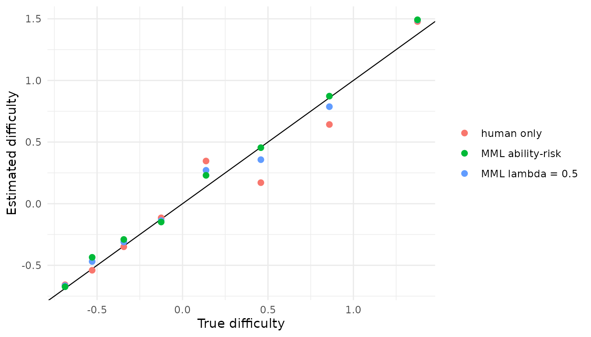

# Mixed-Subjects IRT Calibration

This vignette shows the recommended mixed-subjects workflow for a
unidimensional 2PL model using the **marginal maximum-likelihood-based
estimator** (`fit_mixed_subjects_mml`). The package expects three
response matrices with the same item columns:

- `observed`: $`n`$ rows of binary human responses
- `predicted`: $`n`$ rows of binary predicted LLM-generated responses
  that correspond to the observed human data
- `generated`: $`N`$ rows of additional binary LLM-generated responses
  (typically $`N \gg n`$)

All three matrices must contain binary 0/1 responses. Probability
(fractional) predictions are not accepted — they are not a valid
likelihood input for the marginal IRT objective and break the PPI
correction — so if you have LLM-derived probabilities, sample binary
responses from them first (e.g. `rbinom`).

The fitted objective is

``` math
L_o^{\mathrm{marg}}(\gamma) + \lambda\bigl[ L_g^{\mathrm{marg}}(\gamma) - L_p^{\mathrm{marg}}(\gamma)\bigr]
```

where $`\gamma`$ is a vector of item parameters and each
$`L^\mathrm{marg}`$ is the true IRT marginal negative log-likelihood,
with posteriors recomputed from the current candidate $`\gamma`$ at
every gradient step. Setting $`\lambda = 0`$ recovers the human-only MML
calibration. See the [Choosing
Lambda](http://klintkanopka.com/mixedsubjectsirt/articles/lambda-tuning.md)
vignette for the specific background on why the marginal-MML objective
is preferred over the previous frozen expected-count estimator.

## Simulate example data

``` r

library(mixedsubjectsirt)
library(ggplot2)

set.seed(2026)

n_human    <- 400
n_generated <- 1200
n_items    <- 8

true_pars <- data.frame(
  item = paste0("Item", seq_len(n_items)),
  a    = seq(0.8, 1.6, length.out = n_items),
  d    = seq(-1.1, 1.1, length.out = n_items)
)
true_pars$b <- -true_pars$d / true_pars$a

theta_human <- rnorm(n_human)
observed    <- simulate_2pl(theta_human, true_pars)

# A strongly informative LLM. On the n labeled subjects the LLM's predictions
# match the human responses (the F = Y benchmark from the simulation study), and
# it supplies N additional unlabeled responses drawn from the same 2PL. This is
# the "good predictor" regime, where the method should lean on the LLM data.
# (Further down we show the complementary case of an uninformative LLM, where the
# criterion instead drives lambda to 0.)
predicted <- observed
generated <- simulate_2pl(rnorm(n_generated), true_pars)
```

## Step 1: Fit the human baseline

``` r

human_start <- fit_2pl(observed, technical = list(NCYCLES = 500))
```

## Step 2: Fit the marginal-MML mixed-subjects model

[`fit_mixed_subjects_mml()`](http://klintkanopka.com/mixedsubjectsirt/reference/fit_mixed_subjects_mml.md)
recomputes posterior weights at every gradient evaluation, eliminating
the frozen-posterior gradient asymmetry that causes the older
[`fit_mixed_subjects()`](http://klintkanopka.com/mixedsubjectsirt/reference/fit_mixed_subjects.md)
to inflate item discriminations when the LLM parameters differ from the
human calibration.

``` r

mixed_mml <- fit_mixed_subjects_mml(
  observed  = observed,
  predicted = predicted,
  generated = generated,
  lambda    = 0.5,
  initial_pars = human_start$pars,
  n_quad    = 11
)

mixed_mml
#> mixedsubjectsirt 2PL fit
#>   items:      8
#>   lambda:     0.5
#>   loss:       4.86386
#>   convergence: 0 
#>   estimator:  marginal MML PPI++
```

``` r

mixed_mml$item_pars
#>    item         a          d          b
#> 1 Item1 0.6805024 -1.0137298  1.4896785
#> 2 Item2 1.0593574 -0.8338784  0.7871549
#> 3 Item3 1.0686089 -0.3816318  0.3571295
#> 4 Item4 1.0460975 -0.2835142  0.2710209
#> 5 Item5 1.3649490  0.1870879 -0.1370659
#> 6 Item6 1.5335270  0.4766917 -0.3108467
#> 7 Item7 1.5124249  0.7093155 -0.4689922
#> 8 Item8 1.7327698  1.1534664 -0.6656778
```

## Step 3: Select lambda by ability-score risk

[`tune_lambda_ability_risk()`](http://klintkanopka.com/mixedsubjectsirt/reference/tune_lambda_ability_risk.md)
with `fit_fn = fit_mixed_subjects_mml` selects the $`\lambda`$ that
minimizes propagated ability-score risk $`E[g'\Sigma_\gamma g]`$ (where
$`\Sigma_\gamma`$ is the **Louis-corrected** marginal sandwich
covariance). By default it does this by **direct 1-D optimization** over
`[0, 1]`, returning a continuous $`\lambda`$ — no grid needed.

``` r

ability_tuned <- tune_lambda_ability_risk(
  observed     = observed,
  predicted    = predicted,
  generated    = generated,
  target_resp  = observed,
  initial_pars = human_start$pars,
  fit_fn       = fit_mixed_subjects_mml,
  n_quad       = 11,
  control      = list(maxit = 200)
)

ability_tuned$best_lambda
#> [1] 0.7446881
```

Because the predictor is highly informative, the criterion selects a
substantial $`\lambda`$ — near the theoretical maximum
$`N/(n+N) = 1200/1600 = 0.75`$ — so the method leans heavily on the
generated LLM data. (The returned `summary` records each $`\lambda`$ the
optimizer evaluated, with `selection_risk = Inf` for any that failed to
converge, so selection is protected against numerical failures. When the
predictor is *un*informative the same criterion drives $`\lambda`$ to 0
instead; see “When the LLM is uninformative” below.)

## Step 3b (recommended): cross-fitted $`\lambda`$ tuning

[`tune_lambda_ability_risk()`](http://klintkanopka.com/mixedsubjectsirt/reference/tune_lambda_ability_risk.md)
above selects $`\lambda`$ and fits the final model on the **same** data.
There is no free lunch in doing so: *no-free-lunch* analyses of tuned
prediction-powered inference show that choosing the power parameter on
the data you also estimate with is optimistic — the selected $`\lambda`$
is biased toward looking more helpful than it is, and Wald intervals
built around it can be anti-conservative.

[`tune_lambda_ability_risk_crossfit()`](http://klintkanopka.com/mixedsubjectsirt/reference/tune_lambda_ability_risk_crossfit.md)
removes this optimism by tuning $`\lambda`$ on held-out folds: each
fold’s $`\lambda`$ is chosen using only the *other* folds’ labels, and
the final fit combines them. Pass `fit_fn = fit_mixed_subjects_mml` for
the per-fold tuning and `final_fit_fn = fit_mixed_subjects_mml` so the
final fit is a single scalar-$`\lambda`$ MML model (the fold
$`\lambda`$’s are averaged, weighted by fold size) that
[`vcov()`](https://rdrr.io/r/stats/vcov.html) handles exactly as in Step
4.

``` r

cf_tuned <- tune_lambda_ability_risk_crossfit(
  observed     = observed,
  predicted    = predicted,
  generated    = generated,
  initial_pars = human_start$pars,
  fit_fn       = fit_mixed_subjects_mml,
  final_fit_fn = fit_mixed_subjects_mml,
  n_splits     = 2,          # the standard PPI sample split (also the default)
  n_quad       = 11,
  control      = list(maxit = 200)
)

cf_tuned$lambda_by_split   # one tuned lambda per held-out fold
#> [1] 0.8474932 0.8581241
cf_tuned$lambda_final      # fold-size-weighted scalar used for the final fit
#> [1] 0.8528086
```

`cf_tuned$final_fit` is the calibration to report, and
`vcov(cf_tuned$final_fit)` gives its Louis-corrected covariance. In the
package’s simulation study, cross-fitting leaves item-parameter bias,
held-out scoring RMSE, and 95% interval coverage essentially unchanged
relative to the same-data tuner.

We use `n_splits = 2`, the standard PPI sample split (one half tunes,
the other estimates, then swap) and the function’s default. You may
notice the cross-fitted $`\lambda`$ (here $`\approx 0.85`$) sits *above*
the same-data value ($`\approx 0.7`$) and above the perfect-predictor
ceiling $`N/(n+N) = 0.75`$. That is expected and is **not** evidence of
a better $`\lambda`$: with two folds each $`\lambda`$ is tuned on only
half the labeled subjects ($`n_\text{train} = n/2 = 200`$), and the
PPI-optimal $`\lambda`$ grows as labeled data shrinks — it tracks
$`N/(N + n_\text{train})`$, here $`1200/1400 \approx 0.86`$. The fold
$`\lambda`$’s are tuned for $`n_\text{train}`$ but the final fit applies
their average to the full sample, so they run a little high; more folds
would push $`n_\text{train}`$ toward $`n`$ and pull $`\lambda`$ back
toward the full-sample optimum, but two folds is the convention. The
reason to cross-fit is not the $`\lambda`$ value but that $`\lambda`$ is
chosen without each fold’s own labels, so the reported uncertainty is
not optimistic about a $`\lambda`$ tuned on the same data. The cheaper
same-data tuner in Step 3 is fine for exploration; prefer the
cross-fitted estimate when the selected $`\lambda`$ or its uncertainty
is part of what you report.

## Step 4: Inspect the covariance

[`vcov()`](https://rdrr.io/r/stats/vcov.html) on a scalar-lambda MML fit
automatically uses
[`vcov_mixed_subjects_mml()`](http://klintkanopka.com/mixedsubjectsirt/reference/vcov_mixed_subjects_mml.md),
which applies Louis’ (1982) observed-information correction — the
marginal bread is $`H_\mathrm{comp} - I_\mathrm{miss}`$ rather than the
EM complete-data Hessian alone.

``` r

Sigma <- vcov(ability_tuned$best_fit)
dim(Sigma)  # 2J × 2J
#> [1] 16 16
```

## Compare calibrations

``` r

human_only <- fit_mixed_subjects_mml(
  observed  = observed,
  predicted = predicted,
  generated = generated,
  lambda    = 0,
  initial_pars = human_start$pars,
  n_quad    = 11
)

estimates <- rbind(
  data.frame(estimator = "human only",  human_only$item_pars),
  data.frame(estimator = "MML lambda = 0.5", mixed_mml$item_pars),
  data.frame(estimator = "MML ability-risk",
             ability_tuned$best_fit$item_pars)
)
estimates$true_b <- true_pars$b[match(estimates$item, true_pars$item)]
estimates$true_a <- true_pars$a[match(estimates$item, true_pars$item)]

ggplot(estimates, aes(true_b, b, colour = estimator)) +
  geom_abline(slope = 1, intercept = 0, linewidth = 0.4) +
  geom_point(size = 2) +
  labs(x = "True difficulty", y = "Estimated difficulty", colour = NULL) +
  theme_minimal()
```



## When the LLM is uninformative

The flip side of exploiting a good predictor is doing no harm with a bad
one. Here the LLM answers are essentially unrelated to ability (drawn
from scrambled item parameters), so the paired correction carries no
usable signal:

``` r

set.seed(7)
bad_pars    <- true_pars
bad_pars$a  <- pmax(0.05, abs(rnorm(n_items, 0, 0.1)))   # near-zero slopes
bad_pars$d  <- rnorm(n_items, 0, 2)                       # difficulties unrelated to truth

predicted_bad <- simulate_2pl(theta_human, bad_pars)
generated_bad <- simulate_2pl(rnorm(n_generated), bad_pars)

tuned_bad <- tune_lambda_ability_risk(
  observed     = observed,
  predicted    = predicted_bad,
  generated    = generated_bad,
  target_resp  = observed,
  initial_pars = human_start$pars,
  fit_fn       = fit_mixed_subjects_mml,
  n_quad       = 11,
  control      = list(maxit = 200)
)

tuned_bad$best_lambda   # expect ~0: the useless LLM is correctly ignored
#> [1] 0
```

The criterion drives $`\lambda \to 0`$, recovering the human-only
calibration. So the same selection rule both **exploits** an informative
LLM (the main example, $`\lambda`$ near $`N/(n+N)`$) and **protects
against** an uninformative one ($`\lambda \approx 0`$) — the “no average
harm” property quantified in the simulation study.

## Validation

A full simulation study confirms the recommended workflow behaves as
intended:

- **λ selection tracks predictor quality** — a perfect paired predictor
  (F = Y) selects λ ≈ N/(n+N) = 0.75; a useless predictor is
  down-weighted to λ ≈ 0.
- **The Louis-corrected standard errors are honest** — across all
  regimes, including a useless or biased LLM,
  [`vcov()`](https://rdrr.io/r/stats/vcov.html) on a scalar MML fit
  attains nominal Wald-interval coverage (~0.91/0.96) for both
  discriminations and intercepts, whereas the uncorrected EM-Hessian
  covariance under-covers (~0.71/0.79).
- **No average harm** — tuned ability-score RMSE is no worse than the
  human-only calibration on average (every regime’s mean ΔRMSE is ≤ 0);
  when the predictor is uninformative the method down-weights toward it.

See the [Simulation
Validation](http://klintkanopka.com/mixedsubjectsirt/articles/simulation-validation.md)
vignette for the full results, and `simulations/` in the source tree for
the reproducible harness.
